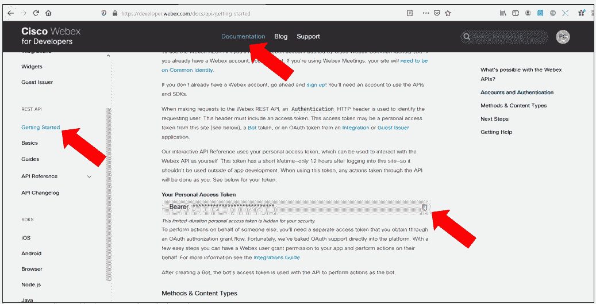

# Introduction

The following instructions aims to help you to check that you have installed into your laptop, the minimum tools required for Python labs.

## Installation

- Create a working directory, into your Devolpement Laptop
- Open a console window and change directory to your working directory

Windows example 

	md test
	cd test

Based on the instructions given in the DEVNET documentation, create a python virtual environment and activate it.

### STEP 1 Install a Python virtual environment

For Linux/Mac 

	python3 -m venv venv
	
	source venv/bin/activate

For Windows 
	
We assume that you already have installed git-bash.  If so open a git-bash console and :

	python -m venv venv 
	
	venv\Scripts\activate

### STEP 2 Clone the scripts

	git clone https://github.com/pcardotatgit/check_dev_tools.git
	cd check_dev_tools
	
### STEP 3 Install needed python modules

We need the **requests** python module

install it with the following console command :

	pip install requests
	
Or you can install them with the following  :
	
	pip install -r requirements.txt

## STEP 4 Get your Webex Token and configure your script

- Go to [developer webex](https://developer.webex.com) and login to your account
- Go to [ documentation ] => REST API / Getting Started

Then Search for : **Your Personal Access Token**

**Copy your Webex token**

Edit the **check.py** script and paste it into the code :

**ACCESS_TOKEN = 'COPY AND PASTE HERE YOUR WEBEX BEARER TOKEN'**

Configure the IP address that was shared with you :

**ip_address=" IP ADDRESS SHARED BY PATRICK HERE"**
**ROOM_ID = 'COPY HERE WEBEX TEAM ROOM ID SHARED BY PATRICK'**

Then run the script: 

	python check.py

## A success message should confirm you that everything is OK.

